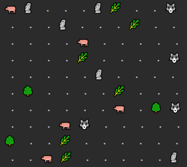

## Симуляция

**[ТЗ проекта](https://zhukovsd.github.io/java-backend-learning-course/Projects/Simulation/)**

На карте размещены:
- Травоядные
- Хищники
- Трава
- Деревья
- Камни

Травоядные ищут траву, сближаясь - съедают. Хищники также ищут и съедают травоядных.